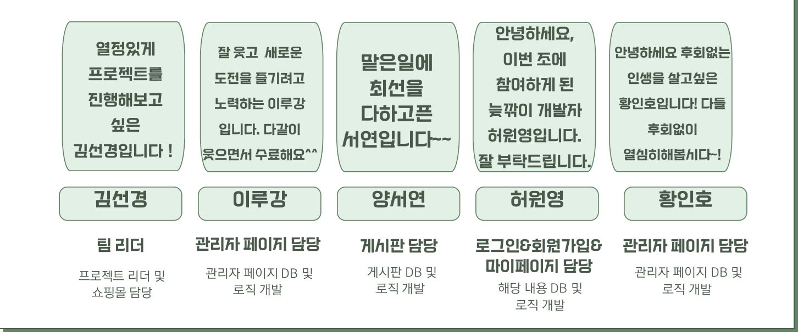
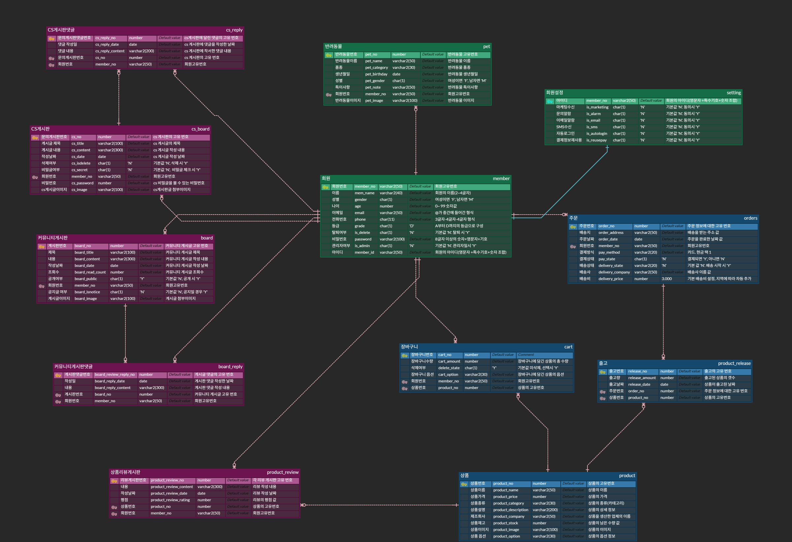
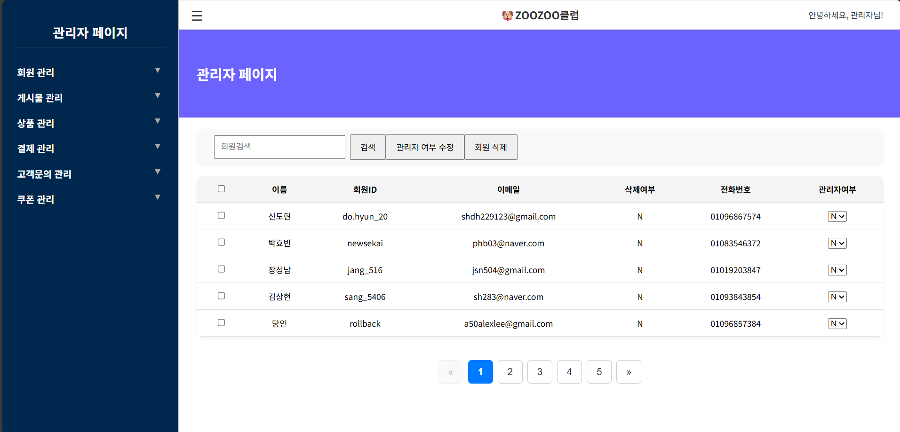

# 🐶 ZOOZOO CLUB | 이루강
> | 반려동물 커뮤니티 & 쇼핑몰 웹사이트 팀 프로젝트  
> 담당 파트: **회원조회 / 회원등급관리 / 회원게시물관리**

## 👥 1. 팀 소개
**팀명:** 미녀와 야수  

유머 감각과 창의성을 바탕으로, 역할과 성별에 구애받지 않고 자유롭게 아이디어를 나누며 협업하는 팀 문화를 지향합니다.  
팀명 속 유쾌함처럼, 프로젝트 또한 즐겁고 개성 있게 풀어나가며 사용자에게도 즐거움을 줄 수 있는 결과물을 목표로 합니다.




**프로젝트명:** ZOOZOO CLUB  

> ‘ZOO’는 반려동물, ‘CLUB’은 보호자들이 모여 소통하는 커뮤니티를 의미합니다.  
> 반려동물과 보호자 모두가 함께 즐기고 배우며 필요한 정보를 얻을 수 있는 따뜻한 온라인 놀이터이자 정보 허브를 지향합니다.

---


## ⚙️ 2. 기술 스택

| 분류 | 사용 기술 |
|------|-------------|
| **운영체제** | window 11 |
| **사용언어** | Java, HTML, CSS, JavaScript, SQL |
| **FrameWork/ Library | FrameWork/ Library |
| **DB** | Oracle |
| **Collaboration** | GitHub, SourceTree |
| **Tool** | Eclipse, Visual studio Code |

---

## 💡 3. 프로젝트 주요 기능  

> ZOOZOO CLUB은 **커뮤니티형 반려동물 쇼핑몰 웹사이트**로,  
> 반려동물 보호자들이 소통하고, 상품을 구매하며, 정보를 나눌 수 있도록 설계되었습니다.

---

### 🏠 메인 기능 요약
| 구분 | 기능 |
|------|------|
| 회원 | 이메일 회원가입 / 로그인 / 마이페이지 |
| 게시판 | 공지사항, 자유게시판, Q&A, 리뷰 게시판 |
| 쇼핑몰 | 상품 등록·수정·삭제, 장바구니, 결제 |
| 관리자 | 회원관리, 게시판 관리, 통계 조회 |
| 기타 | 팝업창, 메시지함, 마이페이지 강화 기능 |

---


## 🌱 프로젝트 개요
**ZOOZOO CLUB**은 반려동물 보호자를 위한 커뮤니티형 쇼핑몰 웹사이트입니다.  
반려인들이 소통하고, 상품을 구매하며, 체험단과 리뷰를 공유할 수 있는 플랫폼입니다.

---

## 💡 프로젝트의 목적
> “반려동물과 함께 사는 사람들을 위한  
> 커뮤니티 기반의 쇼핑몰 및 정보 공유 플랫폼 구축”

---

## ⚙️ 제공하는 기능
- **회원조회** : 회원 정보 조회, 관리자 권한 부여/회수  
- **회원등급관리** : 게시글 수 기반 등급 자동 산정  
- **회원게시물관리** : 게시글 공개/비공개 제어 및 통계 확인  
- **포인트/쿠폰 시스템** : 활동에 따른 포인트 적립 및 쿠폰 발급  
- **체험단 모집** : 사용자 참여형 리뷰 & 상품 체험 신청 기능  

---

## 👩‍💻 담당 기능 상세

| 기능명 | 설명 | 기술 포인트 |
|--------|------|-------------|
| 회원조회 | 다중 회원 선택 및 관리자 여부 변경 | jQuery 체크박스 제어 / Form 동적 전송 |
| 회원등급관리 | 게시글 수 기반 자동 등급 산정 | SQL JOIN + NVL 처리 / MyBatis 매핑 |
| 회원게시물관리 | 게시물 공개/비공개 Ajax 처리 | 비동기 요청 중복 방지 / 실시간 UI 갱신 |

---

## 🧱 ERD


> 주요 테이블: `USER`, `BOARD`, `POINT`, `ATTACHMENT`, `EXPERIENCE_GROUP`  
> 사용자-게시글 관계를 기반으로 등급, 포인트, 쿠폰, 체험단 연동 관리.

---

## 🧩 담당파트 코드리뷰 및 주요 화면 (회원관리 & 게시물관리 담당)

---

### 👥 회원조회


### 👥 1️⃣ 회원 조회 기능

####  문제 상황  
- 관리자 권한을 **행 단위로 즉시 변경(AJAX)** 하도록 구현했으나,  
  클릭 실수 시 **DB에 바로 반영되어 되돌릴 수 없는 문제** 발생.

####  원인 분석  
- `onchange` 이벤트에서 바로 DB로 요청이 전송됨.  
- 관리자 확인 절차 없이 곧바로 update되어 **데이터 무결성 훼손 가능성** 존재.

####  해결 방법  
1. `updateAdminBtn` 클릭 이벤트로 변경 로직을 이동.  
2. `.row-check` 체크박스로 **선택된 회원만** 처리하도록 수정.  
3. 체크된 항목이 없으면 `alert()`로 경고 후 종료.  
4. 변경 전 `confirm()`을 통해 사용자 확인 절차 추가.  
5. 여러 명 수정 시에도 **한 번의 요청으로 일괄 처리 (POST + submit)** 적용.

####  핵심 포인트  
> 실시간 반영보다는 **검증 절차를 강화한 안전성 중심 구조**로 개선.  


### 🏅 회원등급관리


### 🗂️ 회원게시물관리


---

## 🧩 코드리뷰 
```javascript
$('#updateAdminBtn').on('click', function () {
  const checked = $('.row-check:checked');
  if (checked.length === 0) return alert('수정할 회원을 선택하세요.');
  if (!confirm('관리자 여부를 변경하시겠습니까?')) return;

  const form = $('#memberForm');
  form.attr('action', '/admin/updateAdminStatus')
      .attr('method', 'POST')
      .submit();
});
✅ jQuery 기반 다중 회원 선택 및 동적 Form 전송 로직 구현
✅ confirm + 예외처리로 사용자 UX 개선

🧰 기술 스택
분류	기술
Frontend	HTML5, CSS3, JavaScript, jQuery
Backend	Spring Boot 3.x, MyBatis
Database	Oracle 11g
Tools	STS, DBeaver, SourceTree, GitHub


💬 프로젝트 소감
관리자 기능을 직접 구현하며 데이터 흐름 제어와 Ajax 통신의 중요성을 배웠습니다.
단순한 CRUD를 넘어서, 사용자 경험 중심의 기능 설계를 고민할 수 있었습니다.
팀 협업 과정에서 깃 충돌 해결과 커뮤니케이션의 중요성을 깨달았습니다.

🧠 핵심 역량
Spring Boot + MyBatis 기반 백엔드 설계

SQL JOIN 및 데이터 집계 최적화

jQuery 이벤트 제어 및 Ajax 비동기 로직 구현

Git 브랜치 병합 및 협업 경험
